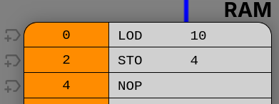
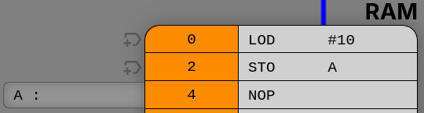
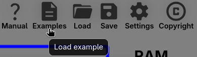

# Maskinkode opgaver

Opgaverne løses med [CPU Visual Simulator](https://cpuvisualsimulator.github.io/).

Denne CPU har nogle forskelle fra den du så i præsentationen.
Den har kun et register som hedder ACC.
Derfor er der ingen grund til at angive hvilket register der er tale om som en del af instruktionen.
Skal du læse en værdi en i en RAM adresse, så bruger du `LOD` til at læse
værdien in i ACC, derefter kan du gemme den i en RAM adresse med `STO`.
F.eks. for at få værdien "10" til at stå i RAM adresse 4, skal du skrive:

Hvis du i stedet vil angive adressen med et label, ser det således ud:

Du kan se et par eksempler på programmer ved klikke på "Examples" knappen.

Se [manualen](https://cpuvisualsimulator.github.io/manual) for beskrivelse af
hele instruktionssæt og flere eksempler.

"NOP" er en forkortelse for no-operation og betyder egentlig bare at CPUen gør ingenting instruktions cyklus.

Du kan stoppe programmet med "HLT" instruktionen, hvilket er en forkortelse for
halt execution.
Uden HLT vil CPUen forsøge at eksekvere de værdier der gemmes i RAM som var det
instruktioner.

_Løs hvad du kan af nedenstående opgaver. Det er OK, hvis ikke du kommer
længere end den første, da de er svære. Vil dog som minimum bede dig om at læse
alle opgaverne samt at give det et forsøg._

## 1. Nedtælling

Lav et program som tæller ned fra 10.

## 2. Gange uden MUL

Lav et program der ganger to tal uden at bruge MUL instruktionen.

## 3. Logik

Lav et program som læser en persons alder fra RAM adresse 32, udregner om en
person er gammel nok til at have stemmeret i Danmark, og gemmer resultatet i
adresse 34.

Du kan bruge værdien 00000001 til at repræsentere sandt (true), altså at
personen er gammel nok.
Og værdien 00000000 til at repræsentere falsk (false), altså at personen ikke
er gammel nok.

## 4. More logik

CPU simulatoren har også en instruktion som hedder ADD og en der hedder OR.
Disse gør det samme som de ADD og OR gates vi har snakket om tidligere, dog
bare med flere bits af gangen.

Disse instruktioner kan bruges til at lave mere kompleks logik.

F.eks. I Danmark skal man både være 18 år eller over og være danske statsborger
for at have stemmeret.
Vi kan gemme i en RAM adresse sandt/falsk om en person er dansk statsborger.
Hvis vi genbruger vores udregning fra tidligere om hvor vidt en person er over
18, sammenholder det med hvorvidt de også er statsborger (AND instruktionen),
så kan vi finde ud af hvorvidt en person har stemmeret til folketingsvalget.

Du behøver ikke at skrive et program for at udregne ovenstående.
Jeg håber bare at det giver en forståelse for at man med simple instruktioner
kan beskrive kompleks logik på en computer.

Denne form for logik bygger på en gren af matematik som hedder boolesk algebra.
Dette kommer du lære mere om i faget Programmering i løbet af de kommende uger.
