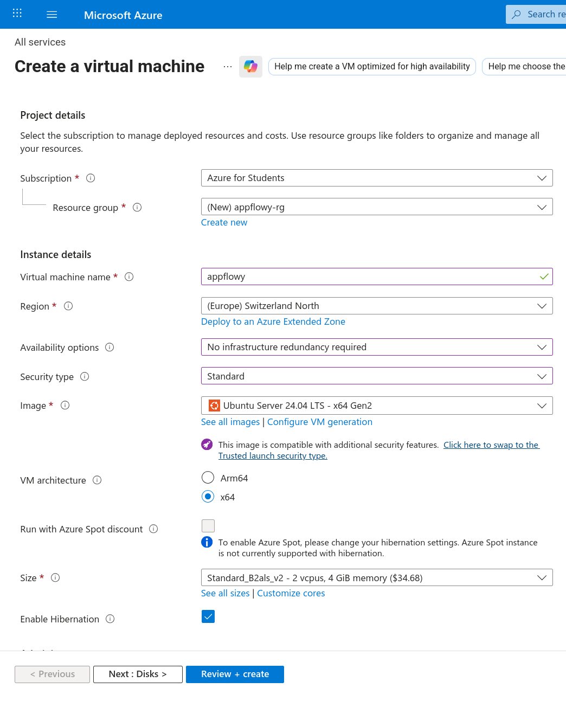
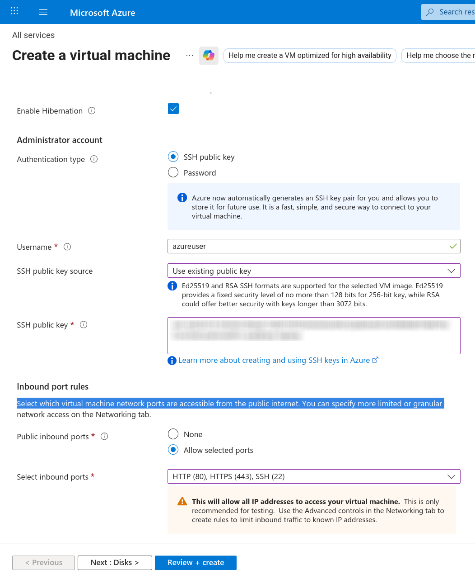

# AppFlowy

## Introduction

[AppFlowy](https://appflowy.com/) is an open source task management, project
planner and notes solution similar to Notion.

It can be self-hosted and there is even a guide to set it up on Azure.

## Setup

> [!CAUTION]
> Make sure you remove all resources again after the lesson.

1. Go to <https://portal.azure.com>.
2. Click "+ Create a resource"
3. Click "Ubuntu Pro 24.04 LTS"
4. Configure as shown in the screenshots.

Then follow instructions at:

**[Installing AppFlowy-Cloud on an Azure Virtual Machine](https://appflowy.com/docs/Installing-AppFlowy-Cloud-on-an-Azure-Virtual-Machine-Ubuntu)**

Don't copy entire block.
Follow line for line.

When you get to `nano .env` you need to change `FQDN` to the IP of your virtual
machine.

Skip "Configuring Custom Domain (Optional)"

## Debug

- Make sure docker is installed `docker compose version`
- Close the shell for added user group to take effect.
- Verify `FQDN` setting in `.env`

## Important

Remove all resources when done with the lesson.
Otherwise, it will eat up your credit.

Removing the resource group `appflowy-rg` should result in all resources being
freed.
Though it might take a while.
I recommend that you double-check after a while.
