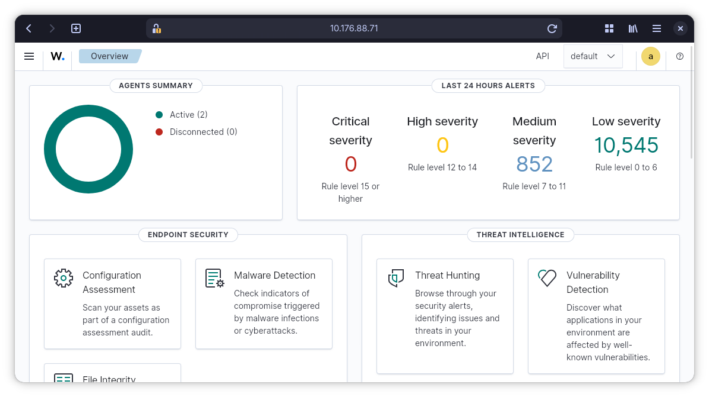
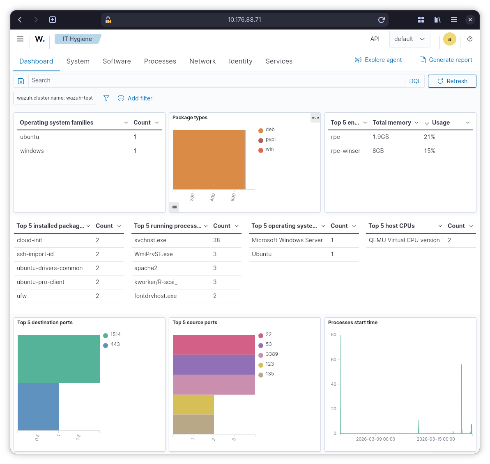
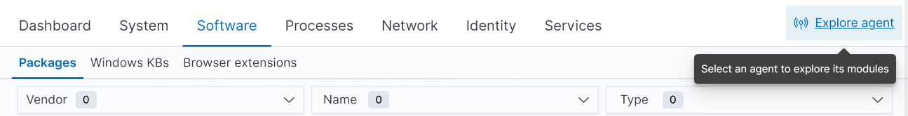
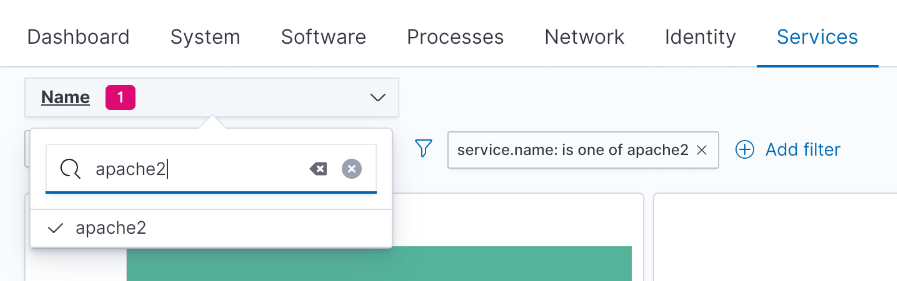
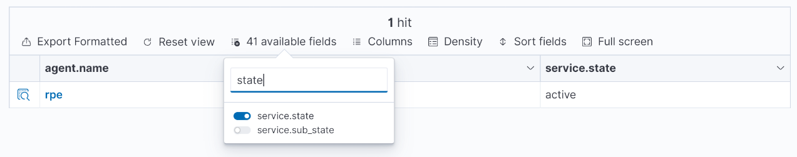

# Wazuh dashboard

Type the IP of your Wazuh server in your web browser to access the dashboard.
It will show a warning that connection is not secure.
The warning is because it is using a self-signed certificate.
It is safe to ignore since we only use it for at lab exercise.

## Login

Login with your credentials.

- Username: admin
- Password was shown during installation of Wazuh.

It should look something like this after login:

## IT Hygiene

The dashboard might look overwhelming at first.
Getting comfortable navigating around the dashboard will take some time.
This guide will only cover a small slice of it.
You are advised to go explorer further on your own afterward.
We will focus on the area called "IT Hygiene".
It is a good source of information to get an overview of all the IT
infrastructure you have in the organization.
In our setup there is only a single endpoint, but imagine each server and all
employee laptops in an organization will be present.

Find and navigate to **IT Hygiene** dashboard.
It looks like this:

*There are two agents (windows & ubuntu) in the setup shown.
You will only have a single Ubuntu.*

## Pinpoint software

New vulnerabilities are being discovered all the time.
Here are some notable examples:

- [Heartbleed](https://en.wikipedia.org/wiki/Heartbleed)
- [Log4Shell](https://en.wikipedia.org/wiki/Log4Shell)
- [Dirty COW](https://en.wikipedia.org/wiki/Dirty_COW)
- [React2Shell](https://react2shell.com/)
- [XZ Utils backdoor](https://en.wikipedia.org/wiki/XZ_Utils_backdoor)
- [RegreSSHion](https://en.wikipedia.org/wiki/RegreSSHion)

You know things are bad when a vulnerability gets its own wikipedia page.
Many organizations don't even know if they are affected.

Just by installing the Wazuh agent, we get automatic inventory of all installed
software.

Let's pretend a vulnerability is discovered in Apache, so we can do a practice
drill in pinpointing exactly what version we have deployed.

1. Click on "Software" tab.
2. In name field, write "apache".
3. Lookup the version shown in the table.

Just because a vulnerable version of a piece of software is
installed doesn't mean that it is vulnerable to attacks.
The vulnerable software needs to be running for an attacker to
exploit it.

You can narrow down our search to a single agent with the "Explore agent" button.

You can then check if the apache2 service is running.
Go to the "Services" tab and search for the service name "apache2".

Then enable the "service.state" field.

Alternatively, you look for "apache2" in the "Processes" tab.

That is it for this quick introduction to the Wazuh dashboard.
I suggest you spend some time to explore further on your own what the dashboard
has to offer.
