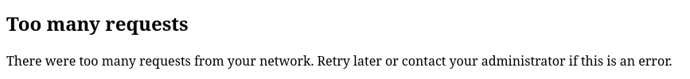

# Fail2ban

What if someone tries to crack password on the login page?
We should ban them right.
But first we need to be able to detect such excessive login attempts.
There is a tool that does just that, it is called `fail2ban` and here is how to
set it up for NextCloud.

First we need to install it.

```sh
sudo apt update
sudo apt install fail2ban
```

Then:

```sh
sudoedit /etc/fail2ban/filter.d/nextcloud.conf
```

Then copy-paste the text:

```
[Definition]
_groupsre = (?:(?:,?\s*"\w+":(?:"[^"]+"|\w+))*)
failregex = ^\{%(_groupsre)s,?\s*"remoteAddr":"<HOST>"%(_groupsre)s,?\s*"message":"Login failed:
            ^\{%(_groupsre)s,?\s*"remoteAddr":"<HOST>"%(_groupsre)s,?\s*"message":"Trusted domain error.
datepattern = ,?\s*"time"\s*:\s*"%%Y-%%m-%%d[T ]%%H:%%M:%%S(%%z)?"
```

Save and exit.

It logs a bit crazy right.
You don't need to understand it all.
Here is the quick version what it does.
It is a filter for the nextcloud log file.
It looks for "Login failed" extracts the remote address and timestamp.

I got the configuration from
[here](https://docs.nextcloud.com/server/stable/admin_manual/installation/harden_server.html#setup-fail2ban).

You can see the log for NextCloud with this command:

```sh
sudo cat /var/www/nextcloud/data/nextcloud.log
```

That is the log file we will have fail2ban to watch failed login attempts using
the filter we just made.
Now, we need to a configuration for how to ban.

```sh
sudoedit /etc/fail2ban/jail.d/nextcloud.local
```

Then copy-paste the following.

```sh
[nextcloud]
backend = auto
enabled = true
port = 80,443
protocol = tcp
filter = nextcloud
banaction = ufw
maxretry = 10
bantime = 1h
findtime = 5m
logpath = /var/www/nextcloud/data/nextcloud.log
```

It tells fail2ban to scan the nextcloud.log (`logpath`) using the filter we
wrote earlier.
It allows 10 failed login attempts (`maxretry`) within a 5 minutes time frame
(`findtime`), any more attempts, and it will ban for 1 hour (`bantime`).
It will band the IP using ufw (`banaction`) because that is the default
firewall on Ubuntu.

Restart fail2ban service with:

```sh
sudo systemctl restart fail2ban.service
```

Try to login to nextcloud many times with the wrong password.
You should see:



If you run `sudo fail2ban-client status nextcloud` you can see which IPs have
been banned.

Hurray, you have banned yourself for an hour!

You can unban yourself with the following command, replacing `<YOUR-IP>` with
the IP listed in the "Banned IP list" from the command above.

```sh
sudo fail2ban-client set nextcloud unbanip <YOUR-IP>
```

This guide was based on [NextCloud - Setup fail2ban](https://docs.nextcloud.com/server/stable/admin_manual/installation/harden_server.html#setup-fail2ban)

fail2ban is not the only tool that can be used to ban attacker IPs.
Here are some alternatives to fail2ban, just for reference:

- [reaction](https://framagit.org/ppom/reaction)
- [CrowdSec](https://github.com/crowdsecurity/crowdsec)
