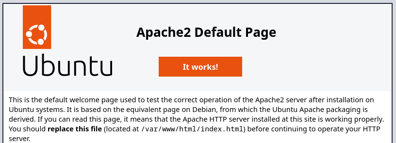

# NextCloud on Ubuntu

<!--toc:start-->
- [NextCloud on Ubuntu](#nextcloud-on-ubuntu)
  - [Installation](#installation)
  - [Sources](#sources)
<!--toc:end-->

## Installation

Before installing stuff, it's a good idea to update the system.
It can be done with the following commands.

```sh
sudo apt update && sudo apt upgrade
```

NextCloud requires a couple of other things to be installed, such as
[PHP](https://en.wikipedia.org/wiki/PHP) (including some modules),
[Apache](https://en.wikipedia.org/wiki/Apache) and
[MariaDB](https://en.wikipedia.org/wiki/MariaDB).
It can be installed with:

```sh
sudo apt install apache2 mariadb-server libapache2-mod-php php-gd php-mysql \
php-curl php-mbstring php-intl php-gmp php-xml php-imagick php-zip
```

MariaDB is a [fork](https://en.wikipedia.org/wiki/Fork_(software_development))
of MySQL, that's why you see a bunch of stuff named mysql.

You can test out the Apache web server by entering the IP of the server in your
web browser.
It should look like this:



We need to initialize the database.
To do that we start a shell with the `mysql` command from where we can send
commands to the database engine.

```sh
sudo mysql
```

You should see the text `MariaDB [(root)]>`.
Now enter the following lines, replacing `username` and `password` with
appropriate values, and confirm them with the Enter key:

```mysql
CREATE USER 'username'@'localhost' IDENTIFIED BY 'password';
CREATE DATABASE IF NOT EXISTS nextcloud CHARACTER SET utf8mb4 COLLATE utf8mb4_general_ci;
GRANT ALL PRIVILEGES ON nextcloud.* TO 'username'@'localhost';
FLUSH PRIVILEGES;
```

Then type `exit` to get back to the normal command shell.
It is even polite enough to say "Bye".

Here is a brief description of the commands.
First we create a new user in the database engine.
Then we create a database schema named `nextcloud`.
We grant the new user all privileges to the new database schema.
Then we apply (flush) the new privileges.

The new user will be used by NextCloud to access the database.

It is generally not recommended to have an application use a database user with
all privileges like we do here.
So we should go back and fix this after we got NextCloud working.
People often forget stuff like this, the accumulation of which leading to a lot
of security issues.

Next we need to download an archive of the latest version of NextCloud.
There are two commands commonly used to download files from web servers.
They are `curl` and `wget`.
We will go with `wget`.

```sh
wget https://download.nextcloud.com/server/releases/latest.zip
```

If you type `ls` you should see the file `latest.zip`.
The file is called latest, because it is the latest stable version of
NextCloud.

We should verify the digital signature for the file we just downloaded, to make
sure it hasn't been tampered with.

```sh
wget https://download.nextcloud.com/server/releases/latest.zip.asc
wget https://nextcloud.com/nextcloud.asc
gpg --import nextcloud.asc
gpg --verify latest.zip.asc latest.zip
```

It should say `Good signature from "Nextcloud Security
<security@nextcloud.com>"`.

It gives us a warning, because it can't guarantee that the signature haven't
been tampered with.
The signature should also have a signature so we can trust it, but then the
signature needs yet another signature, so we can trust... I'm lost.
At some point you got to trust something.

We need to extract the zip archive.

```sh
unzip latest.zip
```

Well, that didn't work.
It says "Command 'unzip' not found...".
Okay, so we just install `unzip` with the command it shows.

```sh
sudo apt install unzip
```

Let's try again.

> [!TIP]
> You can use (arrow up) to get previous commands, so you don't have to retype
> it.

```sh
unzip latest.zip
```

It prints a line for each file in the zip.
It says inflating, because that is the opposite of compressing.

Next, we need to move all the files it to the directory served by Apache web
server.
As the Apache2 Default Page told us, we should place the files in `/var/www` directory.

```sh
sudo cp -r nextcloud /var/www
```

Apache run as a user called `www-data` with limited privileges, because that
limits the damage that can be done by exploiting Apache.
Therefore, we need to change permissions of the nextcloud files, so Apache can
read them.
We can change ownership of files with the `chown` command.

```sh
sudo chown -R www-data:www-data /var/www/nextcloud
```

A configuration file for Apache is needed to make NextCloud work.
Running the following command will open a new configuration file in nano as the super user.

```sh
sudoedit /etc/apache2/sites-available/nextcloud.conf
```

Type the following into nano, save and quit.

```apache
Alias /nextcloud "/var/www/nextcloud/"

<Directory /var/www/nextcloud/>
  Require all granted
  AllowOverride All
  Options FollowSymLinks MultiViews

  <IfModule mod_dav.c>
    Dav off
  </IfModule>
</Directory>
```

For NextCloud to fully function, we need to enable a couple of Apache modules.
Modules can expand the base functionality of Apache.

```sh
sudo a2enmod rewrite
sudo a2enmod headers
sudo a2enmod env
sudo a2enmod dir
sudo a2enmod mime
```

To enable your nextcloud apache configuration, run:

```sh
sudo a2ensite nextcloud.conf
```

We need to restart the apache2 service for the changes to take effect.

```sh
systemctl reload apache2.service
```

Type the IP address of your server in your browser followed by `/nextcloud` to
configure NextCloud.

You need to provide a name and password to create a NextCloud administrator
account.
Then the username, password database name you typed in the `mysql` shell
earlier.

Then click the "Finish setup" button at the bottom of the page.
It can take a moment, so be patient.

Congratulations, you got your own self-hosted "cloud" file hosting.
It comes preloaded with a bunch of example files, so you can see what it can
do.
There are also clients available for various operating systems
[here](https://nextcloud.com/features/?filter=Clients).
The clients allow easy synchronization of files from devices (phones, laptops etc).

> [!caution]
> Don't use this setup as is to sync your precious data.
> There is a bunch of more stuff that needs to be done to make it more secure.
> See [NextCloud - Hardening and security guidance](https://docs.nextcloud.com/server/latest/admin_manual/installation/harden_server.html).
> We will cover some of it later.

This guide is not intended to give you a ready solution to replace your Dropbox
or whatever.
It is just intended to let you do something cool with your Ubuntu server.

## Sources

This guide is based on the following:

- [NextCloud - Example installation on Ubuntu 22.04 LTS](https://docs.nextcloud.com/server/latest/admin_manual/installation/example_ubuntu.html)
- [NextClout - Apache Web server configuration](https://docs.nextcloud.com/server/latest/admin_manual/installation/source_installation.html#apache-configuration-label)
