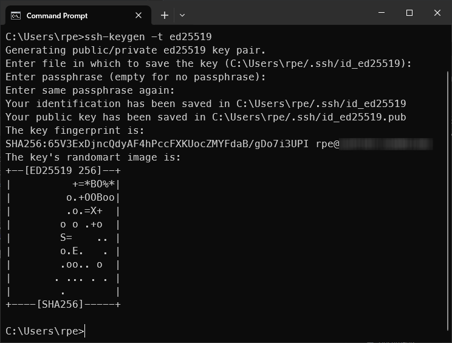

# SSH Keys

## Generate keys

Using passwords to authenticate for SSH is not the safest.
It is much better to use cryptographic keys.

First you need to create a key-pair.
Run this command on your own computer.

```sh
ssh-keygen -t ed25519
```

The `-t ed25519` parameter specifies what type of keys you want to create.
And "ed25519" is generally considered a good option.

You will be asked:

- "Enter file in which to save the key"
  - Hit enter key to accept the default.
- "Enter passphrase"
  - You can enter a passphrase that will be used to encrypt the key.
  - Or hit enter to leave it unencrypted.

The output should look something like this (except that the fingerprint and
randomart will be different).



It will create two keys in your users home directory.
They are `.ssh/id_ed25519` and `.ssh/id_ed25519.pub` where "pub" is short for
public.
You can copy `id_ed25519.pub` to the servers to want to SSH to.
The other `id_ed25519` is private, and should be guarded with your life.

## Copy public key to server

The instructions differ a bit depending on your OS.

### Windows

If you are on Windows, open "Windows Terminal".
On the title bar use the dropdown menu to select "PowerShell".


Replace `<user>` and `<ip>` with the values for your server in the following
command before you run it:

```ps1
type $env:USERPROFILE\.ssh\id_ed25519.pub | ssh <user>@<ip> "mkdir -p ~/.ssh && cat >> ~/.ssh/authorized_keys"
```

### macOS

On macOS (and Linux), you should run the following command in a terminal on
**your own** computer.
Also, replacing `<user>` and `<ip>` with the values for your server.

```sh
cat ~/.ssh/id_ed25519.pub | ssh <user>@<ip> "mkdir -p ~/.ssh && cat >> ~/.ssh/authorized_keys"
```

### Explanation

The file `~/.ssh/authorized_keys` on the server contains all the public keys
that are allowed to log in to it over SSH.
After running the commands above, it should contain exactly one key.
And that is your public key.

The command looks a bit complicated, so here is a breakdown.

- `cat ~/.ssh/id_ed25519.pub` prints/outputs the public key.
  - Same for `type $env:USERPROFILE\.ssh\id_ed25519.pub` on Windows
- `|` redirects the output of the first command to input of the next.
- `ssh` is used to run a single command on that server.
  - The command is `mkdir -p ~/.ssh && cat >> ~/.ssh/authorized_keys`
- `mkdir -p ~/.ssh` creates a `~/.ssh` directory if it doesn't already
exist.
- `&&` is like `and` in python.
- `cat >> ~/.ssh/authorized_keys` appends the input to the file `~/.ssh/authorized_keys`

In short, it appends `~/.ssh/id_ed25519.pub` from **your computer** to
`~/.ssh/authorized_keys` on the **server**.

*Notice: `~/` is the home folder.*

If you think the above key-copy command seems overly complicated you would be
right.
In fact on most Linux versions you can do the same with just `ssh-copy-id
<user>@<ip>`.
However, according to my friend Claude we do not have the `ssh-copy-id` command
on Windows or macOS.

## Disallow password login

The point of creating keys for authentication with SSH, is so we can disable
password authentication.
That way, attackers can't attempt to crack the password.
They would have to somehow steal the `id_ed25519` file from your computer.
And if you entered a passphrase, then they would also have to crack the
encryption.

When you log in to the server, you should be asked to enter the new passphrase
instead of the old user password.
Try it:

```sh
ssh <user>@<ip>
```

Of course replacing `<user>` and `<ip>` with the values for your server.

> [!important]
> The rest of this guide are commands you need to run on the server.

To disable password authentication, you need to edit the configuration for the
SSH [daemon](https://en.wikipedia.org/wiki/Daemon_(computing)).

```sh
sudoedit /etc/ssh/sshd_config
```

Find the line `PasswordAuthentication yes` and change it to
`PasswordAuthentication no` and remove the `#` at the beginning.

You can test it with:

```sh
sudo sshd -T | grep authentication
```

You should see a line that says `passwordauthentication no`.
There might be another config file that overrides the setting.
You can find it with:

```sh
sudo grep -ri passwordauthentication /etc/ssh/sshd_config.d/
```

I had a `/etc/ssh/sshd_config.d/50-cloud-init.conf` file show up.
So I removed it with:

```sh
sudo rm /etc/ssh/sshd_config.d/50-cloud-init.conf
```

Test again:

```sh
sudo sshd -T | grep authentication
```

Should be good now.
For the changes to take effect, you'll need to restart the SSH daemon.

> [!CAUTION]
> Any misconfiguration will leave you unable to access the server via SSH.

You can restart with the following commands:

```sh
sudo systemctl daemon-reload
sudo systemctl restart ssh.socket
```

Make sure you can still access the server.
Type `exit` or hit CTRL+C to logout.
Then run:

```sh
ssh <user>@<ip>
```

As always `<user>` and `<ip>` with the values for your server.
