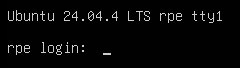

# Installer Ubuntu Server

> [!NOTE] Det er rimelig omstændigt at lave screenshot af alting.
> Derfor får du bare instruktioner som ren tekst her.

- Vælg "Try or Install Ubuntu Server"
- Vælg "English" som sprog, fordi så kan du søge om hjælp på nettet.
- Vælg dansk som keyboard layout.
- Vælg "Ubuntu Server" som installation type.
- Brug standard indstillinger for Network, Proxy, Mirror & Storage configuration.
- Den spørger dig om "Confirm destructive action". Vi bruger en virtuel harddisk, så det er fint.
- Under "Profile configuration":
  - I "Username" feltet, skriver du dit brugernavn (før @ i din email).
  - I "Password" feltet, skriver du at kodeord som du kan huske til næste uge.
  - I "Hostname" feltet, skriver du samme navn som du brugte under oprettelsen af VM i Proxmox.
- Spring over hvor der står "Upgrade to Ubuntu Pro".
- VIGTIG! vælg [x] ved "Install OpenSSH server".
- Ikke vælg noget i "Featured server snaps".
- Vent til den siger "Installation complete!", derefter vælg "Reboot Now".

Vent til du ser en login skærm, som denne.

Skriv det username og password du indtastede under installation.

Noter den IPv4 adresse som står på skærmen.
