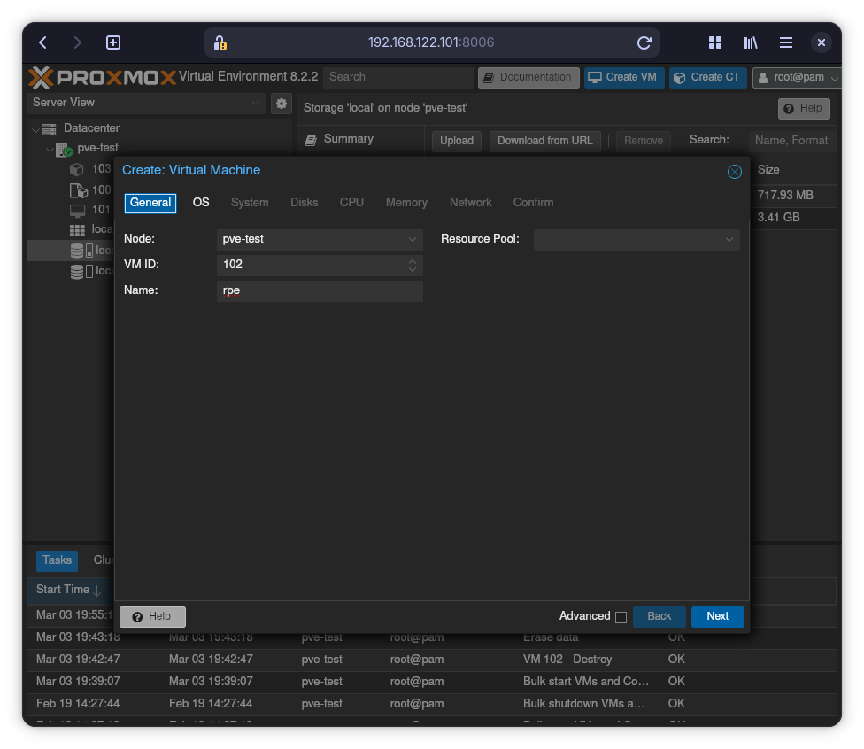
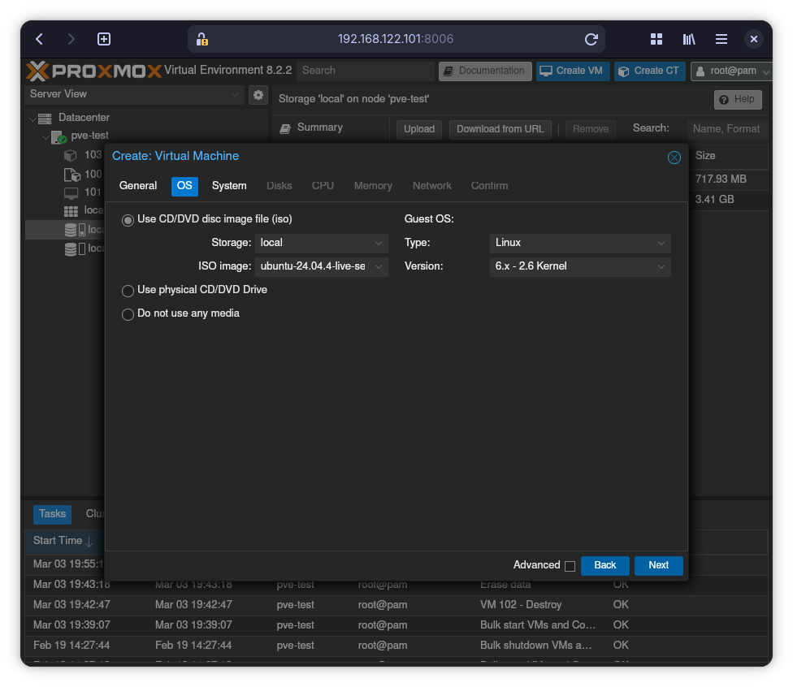
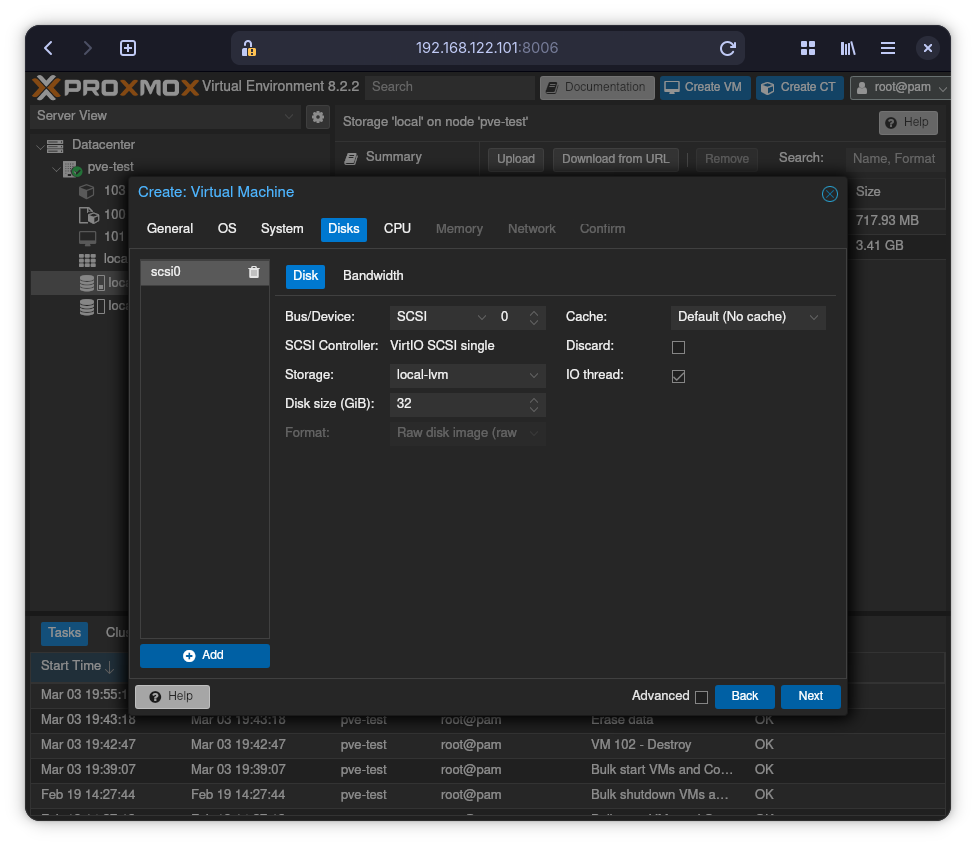
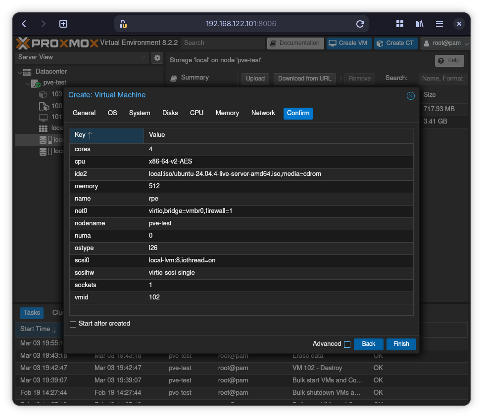

# Opret virtuel maskine (VM)

Prøv at oprette en VM.
Dette gøre ved at klikke på knappen "Create VM" øverst.

Giv den et navn så dig og andre nemt kan kende den.
F.eks. dit brugernavn her på akademiet (første del af din email) efterfulgt af "-ubuntu".
For mig ville det være "rpe-ubuntu".
Klik "Next"!

Vælg Ubuntu ISO filen under "ISO Image" og klik "Next".

Du behøver ikke lave nogle ændringer under "System" fanebladet.
Derfor er dette billede ikke vidst.
Bare klik "Next" igen.

Under "Disk" fanen, vælger du en passende størrelse på den virtuelle harddisk i
feltet "Disk Size (GiB)".
Tallet afhænger af hvad du skal bruge din VM til.
Defter, klik "Next".

Under "CPU" fanen skriver du 1 i "Sockets" feltet og 2 i "Cores" feltet.
Dette kan bruges til at lave begrænsninger på hvor mange ressourcer en VM kan
bruge af fysiske server.
Derved kan man undgå at en VM gør de andre langsomme.

Klik "Next".

Under "Memory" kan du vælge hvor meget hukommelse (RAM) din VM har til
rådighed.
I de fleste tilfælde vil 2048 MiB (mega-bytes) være nok.

Klik "Next".

Under "Network" fanen behøver vi ikke ændre noget, så bare "Next" igen.

Til slut får du en opsummering hvad du har valgt.

Du burde nu kunne se navnet på din VM i navigationen i venstre side.
Dobbelt-klik på navnet.
Derefter på knappen "⏻ Start now".

## [Installer Ubuntu Server](./install-ubuntu-server.md)
