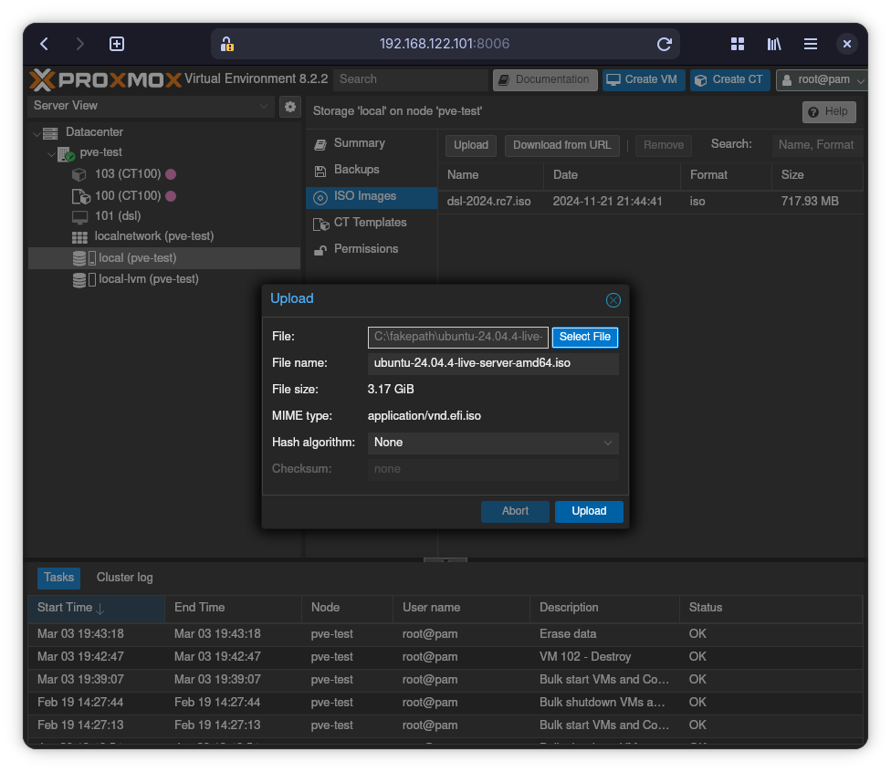

# Upload ISO

I navigations træet til venstre, find et sted hvor der står noget med storage.
I mit tilfælde hedder den "local (pve-test)" men det afhænger af hvad du kaldte
serveren under installationen af Proxmox.

Når du har fundet det, klikker du på "ISO Images", derefter "Upload" knappen.
Vælg Ubuntu Server ISO filen som du downloade tidligere.

Klik på "Upload" knappen i boksen.
