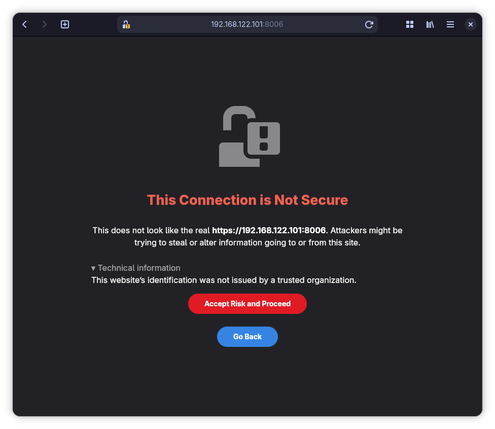
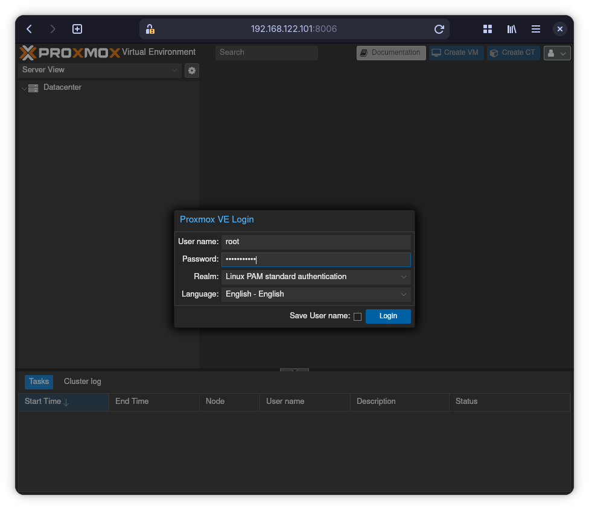
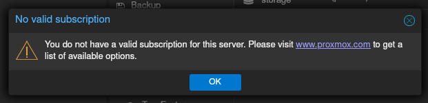

# Proxmox VM

Her er hvordan du lave din første virtuelle maskine (VM) på en frisk Proxmox
installation.
I den virtuelle maskine installere vi Ubuntu Server.
Efter som download godt kan tage lidt tid, så kan vi ligeså godt sætte den
igang med det samme.

[Klik her for at downloade ISO filen](https://ubuntu.com/download/server/thank-you?version=24.04.4&architecture=amd64&lts=true).

## Administrations interface

Find den fysiske server og tilslut en skærm.
Noter adressen der står på skærmen.
Derefter behøver ikke have en skærm tilsluttet serveren igen.

Skriv adressen ind i en web browser på din bærbar.

Du vil få en advarsel om at forbindelsen ikke er sikkert.
Accepter og fortsæt.

> [!TIP]
> Skærm billedet vil se anderledes ud afhængig af din browser.

## Login

Derefter login, med "root" som brugernavn og det password som du skrev under
installationen af Proxmox.

Du behøver ikke en subscription.
Bare klik "OK".

## Upload ISO

I navigations træet til venstre, find et sted hvor der står noget med storage.
I mit tilfælde hedder den "local (pve-test)" men det afhænger af hvad du kaldte
serveren under installationen af Proxmox.

Når du har fundet det, klikker du på "ISO Images", derefter "Upload" knappen.
Vælg Ubuntu Server ISO filen som du downloade tidligere.

Klik på "Upload" knappen i boksen.

## Opret virtuel maskine (VM)

Du er nu klar til at opretter en VM.
Dette gøre ved at klikke på knappen "Create VM" øverst.

Giv den et navn så dig og andre nemt kan kende den.
F.eks. dit brugernavn her på akademiet (første del af din email) efterfulgt af "-ubuntu".
For mig ville det være "rpe-ubuntu".
Klik "Next"!

Vælg Ubuntu ISO filen under "ISO Image" og klik "Next".

Du behøver ikke lave nogle ændringer under "System" fanebladet.
Derfor er dette billede ikke vidst.
Bare klik "Next" igen.

Under "Disk" fanen, vælger du en passende størrelse på den virtuelle harddisk i
feltet "Disk Size (GiB)".
Tallet afhænger af hvad du skal bruge din VM til.
Defter, klik "Next".

Under "CPU" fanen skriver du 1 i "Sockets" feltet og 2 i "Cores" feltet.
Dette kan bruges til at lave begrænsninger på hvor mange ressourcer en VM kan
bruge af fysiske server.
Derved kan man undgå at en VM gør de andre langsomme.

Klik "Next".

Under "Memory" kan du vælge hvor meget hukommelse (RAM) din VM har til
rådighed.
I de fleste tilfælde vil 2048 MiB (mega-bytes) være nok.

Klik "Next".

Under "Network" fanen behøver vi ikke ændre noget, så bare "Next" igen.

Til slut får du en opsummering hvad du har valgt.

Du burde nu kunne se navnet på din VM i navigationen i venstre side.
Dobbelt-klik på navnet.
Derefter på knappen "⏻ Start now".

## [Installer Ubuntu Server](./proxmox-vm.md)
