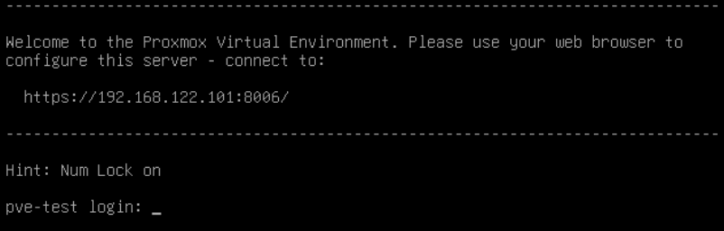

# Proxmox VM

Her er hvordan du lave din første virtuelle maskine (VM) på en frisk Proxmox
installation.
I den virtuelle maskine installere vi Ubuntu Server.
Efter som download godt kan tage lidt tid, så kan vi ligeså godt sætte den
igang med det samme.

[Klik her for at downloade ISO filen](https://ubuntu.com/download/server/thank-you?version=24.04.4&architecture=amd64&lts=true).

## Vigtig information

Du skal bruge følgende information.

1. Adressen til konfiguration af Proxmox.
2. Brugernavn og kodeord

### 1. Adressen til konfiguration af Proxmox

Find den fysiske server og tilslut en skærm.
Noter adressen der står på skærmen.
Derefter behøver ikke have en skærm tilsluttet serveren igen.

*I dette eksempel er adressen `https://192.168.122.101:8006/`, men du vil
sandsynligvis se noget andet.*

### 2. Brugernavn og kodeord

Der vil være en bruger med brugernavnet "root" og det password som blev
indtastet under installation af Proxmox.

Har du ikke selv installeret, så spørg efter det.

## Opret første VM

For at oprette en første virtuelle maskine på en frisk Proxmox installation,
kan du følge disse guides, en efter en.

- [Login](./proxmox-login.md)
- [Upload ISO](./proxmox-upload-iso.md)
- [Opret VM](./proxmox-create-vm.md)
- [Install Ubuntu Server](./install-ubuntu-server.md)
